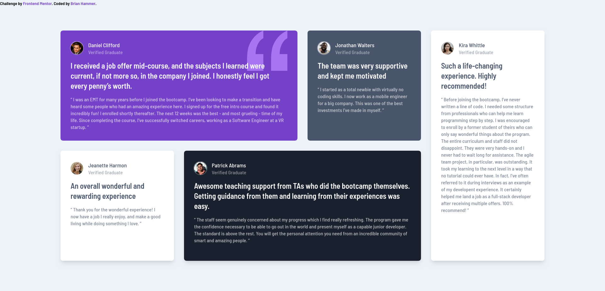
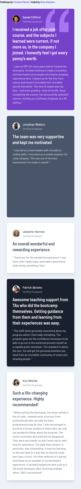

# Frontend Mentor - Testimonials grid section solution

This is a solution to the [Testimonials grid section challenge on Frontend Mentor](https://www.frontendmentor.io/challenges/testimonials-grid-section-Nnw6J7Un7). Frontend Mentor challenges help you improve your coding skills by building realistic projects.

## Table of contents

- [Setup](#setup)
- [Overview](#overview)
  - [The challenge](#the-challenge)
  - [Screenshot](#screenshot)
  - [Links](#links)
- [My process](#my-process)
  - [Built with](#built-with)
  - [What I learned](#what-i-learned)
  - [Continued development](#continued-development)
  - [Useful resources](#useful-resources)
- [Author](#author)

**Note: Delete this note and update the table of contents based on what sections you keep.**

## Setup

To edit the code, run:
npx tailwindcss -i ./input.css -o ./output.css --watch

## Overview

### The challenge

Users should be able to:

- View the optimal layout for the site depending on their device's screen size

### Screenshots

## Desktop

## Mobile

### Links

- Solution URL: [Add solution URL here](https://your-solution-url.com)
- Live Site URL: [Add live site URL here](https://your-live-site-url.com)

## My process

### Built with

- Semantic HTML5 markup
- CSS custom properties
- Flexbox
- CSS Grid
- Mobile-first workflow

### What I learned

I finally learned how to use CSS grids effectively, instead of just flexbox. I learned how to resize and reposition each element in the grid as well. I have also realized the value of the 'container' element  because it makes everything more predictable.

Another thing I learned is how to add a background image inside of tailwind css and resize/reposition the image. I did this with the quotation mark.

### Continued development

One thing I noticed is that the default shadows in tailwind CSS do not look the same as the design. Next thing I want to learn is how to modify the shadows to make them look more accurate to the design.

### Useful resources

Tailwind docs and various google searches.

## Author

- Frontend Mentor - [@brianhammer](https://www.frontendmentor.io/profile/brianhammer)